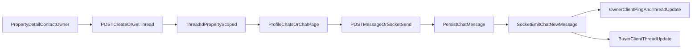

# Property Chat Rollout Plan

## Scope

Build 1:1 chat between buyer/renter and owner, scoped to a specific property, with realtime updates via WebSocket. Replace profile `Inquiries` with `Chats`, and update property detail `Contact Owner` to start/open chat instead of email.

## Backend Changes

- Add chat schema in [node-backend/storage/createTables.js](/Users/evasharma/Desktop/Projects/2BHK/2BHK/node-backend/storage/createTables.js):
  - `chat_threads`:
    - `thread_id` PK
    - `property_id` FK -> `properties`
    - `owner_user_id` FK -> `users`
    - `participant_user_id` FK -> `users`
    - `last_message_at`, `last_message_text` (denormalized)
    - `created_at`, `updated_at`
    - unique index `(property_id, owner_user_id, participant_user_id)`
  - `chat_messages`:
    - `message_id` PK
    - `thread_id` FK -> `chat_threads`
    - `sender_user_id` FK -> `users`
    - `message_text` (TEXT)
    - optional `message_type` (`text` for now)
    - `is_read` (per receiver for MVP)
    - `created_at`
    - indexes on `(thread_id, created_at)`, `(thread_id, is_read)`
- Add chat model layer (new files):
  - `models/chatThread.model.js`
  - `models/chatMessage.model.js`
- Add chat controller + routes:
  - `controllers/chat.controller.js`
  - `routes/chat.routes.js`
  - mount in [node-backend/server.js](/Users/evasharma/Desktop/Projects/2BHK/2BHK/node-backend/server.js) as `/api/chats`
- REST endpoints (auth required):
  - `POST /api/chats/threads` create-or-get thread for `{ property_id }` using current user + property owner
  - `GET /api/chats/threads` list user’s threads with property summary and unread count
  - `GET /api/chats/threads/:threadId/messages?before=<id>&limit=<n>` paginated messages
  - `POST /api/chats/threads/:threadId/messages` send message
  - `POST /api/chats/threads/:threadId/read` mark inbound messages read
- Validation/authorization rules:
  - only owner and participant can access thread/messages
  - prevent owner from starting chat with self on own property
  - ensure thread owner matches property owner at creation time

## Realtime Layer (Socket)

- Add Socket.IO server integration in [node-backend/server.js](/Users/evasharma/Desktop/Projects/2BHK/2BHK/node-backend/server.js):
  - auth handshake using JWT
  - join per-user room (`user:<id>`) and per-thread room on request
- Socket events:
  - client -> server: `chat:join_thread`, `chat:leave_thread`, `chat:send_message`, `chat:mark_read`
  - server -> client: `chat:new_message`, `chat:thread_updated`, `chat:read_receipt`
- Keep REST as source of truth; socket emits mirror state changes after DB commit.

## Frontend Changes

- API client updates in [react-frontend/src/utils/api.js](/Users/evasharma/Desktop/Projects/2BHK/2BHK/react-frontend/src/utils/api.js):
  - add chat methods for thread list, message list, send, mark read, create-or-get thread
- Add chat UI module (new components):
  - `components/Chat/ChatList.jsx`
  - `components/Chat/ChatThread.jsx`
  - `components/Chat/ChatComposer.jsx`
  - `components/Chat/ChatDrawerOrPage.jsx`
- Profile updates:
  - replace `inquiries` tab with `chats` in [react-frontend/src/pages/ProfilePage.jsx](/Users/evasharma/Desktop/Projects/2BHK/2BHK/react-frontend/src/pages/ProfilePage.jsx)
  - remove `MyInquiries` usage in [react-frontend/src/components/Profile/SavedProperties.jsx](/Users/evasharma/Desktop/Projects/2BHK/2BHK/react-frontend/src/components/Profile/SavedProperties.jsx) and render chat list component
- Property detail Contact Owner updates:
  - edit [react-frontend/src/components/ContactOwner.jsx](/Users/evasharma/Desktop/Projects/2BHK/2BHK/react-frontend/src/components/ContactOwner.jsx)
  - replace email action with `Start Chat` / `Open Chat`:
    - call create-or-get thread API for this property
    - route to profile chats tab with selected thread (or dedicated `/chats/:threadId` route)
  - keep phone call action if desired; remove email CTA per requirement
- Property detail wiring:
  - pass property id + owner id into `ContactOwner` from [react-frontend/src/pages/PropertyDetailPage.jsx](/Users/evasharma/Desktop/Projects/2BHK/2BHK/react-frontend/src/pages/PropertyDetailPage.jsx)

## UX/Data Requirements

- Thread list item includes:
  - owner/participant name
  - property mini context (`bhk + locality + city`) + property link
  - last message + timestamp
  - unread badge
- Message bubble includes:
  - sender side, text, time
- Empty states:
  - owner: “No chats yet for your properties”
  - buyer/renter: “No chats yet, start from a property detail page”

## Migration/Compatibility

- Leave old inquiries UI/API paths unused in frontend (no hard deletion initially).
- Optionally remove inquiries-specific codepaths later after chat rollout stabilizes.

## Validation & Test Plan

- Backend:
  - create thread from property detail as buyer/renter
  - owner sees thread with correct property context
  - message persistence and authorization checks
  - read receipts update unread counts
- Frontend:
  - profile chats list renders and opens correct thread
  - property detail opens/creates property-scoped chat
  - property link in chat thread routes correctly
- Realtime:
  - two browser sessions receive `chat:new_message` instantly
  - offline/reload still correct via REST fetch

## Mermaid Flow

