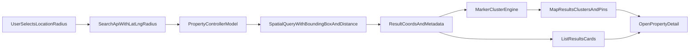

# Spatial Search + Map UX Rollout Plan (Updated)

## Locked Decisions

- Map stack: Google Maps JavaScript API.
- Data migration: delete all existing `properties` rows before cutover.
- Anti-clutter strategy: marker clustering + viewport-driven rendering + marker cap.

## Execution Order

### 1) Spatial schema + destructive migration

- Add location fields in `properties`:
  - `location POINT NOT NULL SRID 4326`
  - `address_text TEXT NULL`
  - `SPATIAL INDEX idx_location (location)`
- Run destructive migration/reset for `properties` as agreed.
- Files:
  - [/Users/evasharma/Desktop/Projects/2BHK/2BHK/node-backend/storage/createTables.js](/Users/evasharma/Desktop/Projects/2BHK/2BHK/node-backend/storage/createTables.js)
  - [/Users/evasharma/Desktop/Projects/2BHK/2BHK/node-backend/models/property.model.js](/Users/evasharma/Desktop/Projects/2BHK/2BHK/node-backend/models/property.model.js)

### 2) Property write-path with coordinates

- Require/stash `latitude`, `longitude`, and optional `address_text` on create/update.
- Save using `ST_SRID(POINT(lng, lat), 4326)` and validate ranges.
- Return coords in read payloads (`lat`, `lng`) for map markers.
- Files:
  - [/Users/evasharma/Desktop/Projects/2BHK/2BHK/node-backend/controllers/property.controller.js](/Users/evasharma/Desktop/Projects/2BHK/2BHK/node-backend/controllers/property.controller.js)
  - [/Users/evasharma/Desktop/Projects/2BHK/2BHK/node-backend/models/property.model.js](/Users/evasharma/Desktop/Projects/2BHK/2BHK/node-backend/models/property.model.js)

### 3) Efficient radius filtering backend

- Replace text location search with lat/lng/radius search:
  - Inputs: `lat`, `lng`, `radius_km` (default 10)
- Query approach:
  - Bounding-box prefilter
  - Exact distance with `ST_Distance_Sphere`
- Return computed distance for sorting/display.
- Files:
  - [/Users/evasharma/Desktop/Projects/2BHK/2BHK/node-backend/models/property.model.js](/Users/evasharma/Desktop/Projects/2BHK/2BHK/node-backend/models/property.model.js)
  - [/Users/evasharma/Desktop/Projects/2BHK/2BHK/node-backend/controllers/property.controller.js](/Users/evasharma/Desktop/Projects/2BHK/2BHK/node-backend/controllers/property.controller.js)

### 4) Post Property map-pick flow

- In Post Property, enforce map selection for coordinates.
- Autocomplete + selectable map point in Step 1; persist coords in payload.
- Keep optional `address_text` field for user-provided context.
- Files:
  - [/Users/evasharma/Desktop/Projects/2BHK/2BHK/react-frontend/src/components/PostProperty/PropertyBasicInfo.js](/Users/evasharma/Desktop/Projects/2BHK/2BHK/react-frontend/src/components/PostProperty/PropertyBasicInfo.js)
  - [/Users/evasharma/Desktop/Projects/2BHK/2BHK/react-frontend/src/components/PostProperty/PostProperty.js](/Users/evasharma/Desktop/Projects/2BHK/2BHK/react-frontend/src/components/PostProperty/PostProperty.js)
  - [/Users/evasharma/Desktop/Projects/2BHK/2BHK/react-frontend/src/utils/api.js](/Users/evasharma/Desktop/Projects/2BHK/2BHK/react-frontend/src/utils/api.js)

### 5) Search UI: autocomplete + radius controls

- Location autocomplete in search/filter UI.
- Add `Search Radius` field (default 10km, user editable).
- URL/query model includes `lat/lng/radius_km`.
- Files:
  - [/Users/evasharma/Desktop/Projects/2BHK/2BHK/react-frontend/src/components/PropertySearchForm.jsx](/Users/evasharma/Desktop/Projects/2BHK/2BHK/react-frontend/src/components/PropertySearchForm.jsx)
  - [/Users/evasharma/Desktop/Projects/2BHK/2BHK/react-frontend/src/components/PropertyFilters.jsx](/Users/evasharma/Desktop/Projects/2BHK/2BHK/react-frontend/src/components/PropertyFilters.jsx)
  - [/Users/evasharma/Desktop/Projects/2BHK/2BHK/react-frontend/src/pages/PropertiesListPage.jsx](/Users/evasharma/Desktop/Projects/2BHK/2BHK/react-frontend/src/pages/PropertiesListPage.jsx)

### 6) Properties page split view (map + cards)

- Desktop/tablet: 40% map + 60% card list.
- Mobile: toggle between `Map Results` and `List Results`.
- Marker click opens lightweight property preview and deep-link.
- Files:
  - [/Users/evasharma/Desktop/Projects/2BHK/2BHK/react-frontend/src/pages/PropertiesListPage.jsx](/Users/evasharma/Desktop/Projects/2BHK/2BHK/react-frontend/src/pages/PropertiesListPage.jsx)
  - [/Users/evasharma/Desktop/Projects/2BHK/2BHK/react-frontend/src/pages/PropertiesListPage.css](/Users/evasharma/Desktop/Projects/2BHK/2BHK/react-frontend/src/pages/PropertiesListPage.css)

### 7) Marker anti-clutter implementation (new explicit phase)

- Add Google marker clustering:
  - cluster nearby markers, split progressively with zoom.
- Viewport-driven fetch/render:
  - request/render only current map bounds (+padding).
- Marker cap guardrail:
  - map renders max N (e.g., 300) items and shows guidance message.
- Zoom behavior:
  - low zoom: clusters only,
  - higher zoom: individual markers.
- Debounce map interactions (250-400ms) before fetch.
- This phase ensures large-radius searches stay fast and readable.

### 8) Property detail map alignment

- Use stored coordinates first on detail page map.
- Fallback to address string if coordinates missing.
- Files:
  - [/Users/evasharma/Desktop/Projects/2BHK/2BHK/react-frontend/src/pages/PropertyDetailPage.jsx](/Users/evasharma/Desktop/Projects/2BHK/2BHK/react-frontend/src/pages/PropertyDetailPage.jsx)

### 9) Hardening, perf checks, rollout

- Env + API key validation and clear fallback errors.
- Regression + performance tests for:
  - post with map coordinates,
  - radius search accuracy,
  - cluster behavior at large radii,
  - map/list sync and responsive toggle.

## Architecture View

## Implementation Defaults for Clutter Control

- Default radius: `10km`.
- Marker cap on map: `300`.
- Cluster enabled at all zooms; individual markers emphasized at zoom `>= 13`.
- Map move/zoom fetch debounce: `300ms`.
